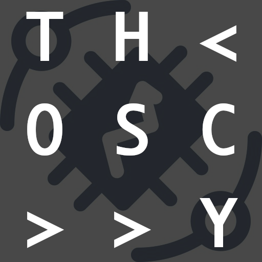

thoscy
======



_thoscy: **th**ingsboard **osc** rela**y**_

Relay messages between a ThingsBoard server and OSC.

This code base has been developed by [ZKM | Hertz-Lab](https://zkm.de/en/about-the-zkm/organization/hertz-lab) as part of the project [»The Intelligent Museum«](#the-intelligent-museum). 

Copyright (c) 2022 ZKM | Karlsruhe.  
Copyright (c) 2022 Dan Wilcox.  

BSD Simplified License.

Description
-----------

This set of scripts act as relay servers for forwarding device events between a ThingsBoard server using MQTT/WebSockets and OSC (Open Sound Control) messages. `thoscy-send` forwards messages from OSC to a ThingsBoard host over MQTT while `thoscy-recv` listens for ThingsBoard device events on a WebSocket and forwards them over OSC. This is useful for creative coding tools which work with OSC messages natively, but do not have built-in MQTT or WebSocket support.

From [thingsboard.io](https://thingsboard.io):

>ThingsBoard is an open-source IoT platform for data collection, processing, visualization, and device management
>It enables device connectivity via industry standard IoT protocols - MQTT, CoAP and HTTP and supports both cloud and on-premises deployments. ThingsBoard combines scalability, fault-tolerance and performance so you will never lose your data.

From [opensoundcontrol.org](OpenSoundControl.org):

>OpenSoundControl (OSC) is a data transport specification (an encoding) for realtime message communication among applications and hardware.

Dependencies
------------

* Python 3
* [tb-mqtt-client](https://github.com/thingsboard/thingsboard-python-client-sdk)
* [python-osc](https://github.com/attwad/python-osc)
* [websockets](https://github.com/aaugustin/websockets)
* [pyjwt](https://github.com/jpadilla/pyjwt)
* [requests](https://github.com/psf/requests)

Setup
-----

Install Python 3, if not already available. For instance, on macOS using [Homebrew](http://brew.sh):

```shell
brew install python3
```

Create a virtual environment and install the script's dependencies:

```shell
make
```

### ThingsBoard

If starting with ThingsBoard from scratch, it's highly recommended to first consult the official ThingsBoard Community [Getting Started Guide](https://thingsboard.io/docs/getting-started-guides/helloworld/).

Once a device is created, sending and receiving via the server host and device access token should be possible using the thoscy tools.

Running
-------

Send and receive functionality is split into two separate scripts: `thoscy-send` and `thoscy-recv`.

### thoscy-send

Start an OSC send server on the commandline via the virtual environment wrapper script:

    ./thoscy-send HOST TOKEN

`HOST` is the ThingsBoard server host name, ie. board.mydomain.com.

`TOKEN` is the ThingsBoard device access token.

Once running, thoscy-send automatically parses OSC messages into telemetry messages to send to the device on ThingsBoard via MQTT. Message handling is as follows:

* Send single values: `"/some/value 123" -> {"value": 123}`
  - Last address component used as entity key
  - First argument uses as entity value
  - Message must contain at least one argument
* Send multiple values: `"/telemetry value1 123 value2 456" -> {"value1": 123, "value2": 456}`
  - Arguments are treated as entity key/value pairs
  - Each argument key must be a string type
  - Message must contain at least two arguments (key/value pair)

To configure the OSC receive address and ports, see the commandline argument help by running:

    ./thoscy-send -h

Defaults are:

* osc recv address: 127.0.0.1
* osc recv port: 7777

To stop thoscy-send, use CTRL+C to issue an interrupt signal.

### thosy-recv

Start an OSC receive server on the commandline via the virtual environment wrapper script:

    ./thoscy-recv HOST TOKEN USER PASS

`HOST` is the ThingsBoard server host name, ie. board.mydomain.com

`TOKEN` is the ThingsBoard device access token.

`USER` and `PASS` are the ThingsBoard user login credentials.

Once running, thoscy-recv automatically parses ThingsBoard device telemetry messsages received over a WebSocket into OSC messages. Message handling is as follows:

* Receive single values: `{"value": 123} -> "/value 123"`
  - Key/value pairs sent in individual OSC messages
  - Entity key used as address component
  - JSON key/value pairs are ignored
* Receive multiple values: `{"value1": 123, "value2": 456} -> "/telemetry value1 123 value2 456"`
  - Key/value pairs sent in a OSC single message
  - Key/value pairs appended as arguments
  - JSON key/value pairs are ignored

_Note: Forwarding telemetry messages as a `/telemetry` OSC message with multiple values requires using the `-t/--telemetry` commandline option._

To configure the OSC send address and ports, see the commandline argument help by running:

    ./thoscy-recv -h

Defaults are:

* osc send address: 127.0.0.1
* osc send port: 7788

To stop thoscy-send, use CTRL+C to issue an interrupt signal.

### Calling Python script directly

The Python scripts can be called directly without the wrapper script, but requires manually enabling or disabling the virtual environment:

Activate the virtual environment before the first run in a new commandline session:

    source venv/bin/activate

Use:

    ./thoscy-send.py -h

When finished, deactivate the virtual environment with:

    deactivate

Example Clients
---------------

A couple of example clients are included:

* pd/sendclient.pd: Pure Data patch which sends OSC messages
* pd/recvclient.pd: Pure Data patch which receives OSC messages

Both examples should work together with the default address & ports on the same localhost:

    pd/sendclient.pd --OSC-> thoscy-send.py ----MQTT---> ThingsBoard server
    pd/recvclient.pd <-OSC-- thoscy-recv.py <-WebSocket- ThingsBoard server

First start thoscy-send or thoscy-recv, then start the affiliated client, ie. sendclient.pd & thoscy-send. To see data changing on the server, create/open a ThingsBoard Dashboard with widgets that show the device entity values.

The Intelligent Museum
----------------------

An artistic-curatorial field of experimentation for deep learning and visitor participation

The [ZKM | Center for Art and Media](https://zkm.de/en) and the [Deutsches Museum Nuremberg](https://www.deutsches-museum.de/en/nuernberg/information/) cooperate with the goal of implementing an AI-supported exhibition. Together with researchers and international artists, new AI-based works of art will be realized during the next four years (2020-2023).  They will be embedded in the AI-supported exhibition in both houses. The Project „The Intelligent Museum” is funded by the Digital Culture Programme of the [Kulturstiftung des Bundes](https://www.kulturstiftung-des-bundes.de/en) (German Federal Cultural Foundation) and funded by the [Beauftragte der Bundesregierung für Kultur und Medien](https://www.bundesregierung.de/breg-de/bundesregierung/staatsministerin-fuer-kultur-und-medien) (Federal Government Commissioner for Culture and the Media).

As part of the project, digital curating will be critically examined using various approaches of digital art. Experimenting with new digital aesthetics and forms of expression enables new museum experiences and thus new ways of museum communication and visitor participation. The museum is transformed to a place of experience and critical exchange.


